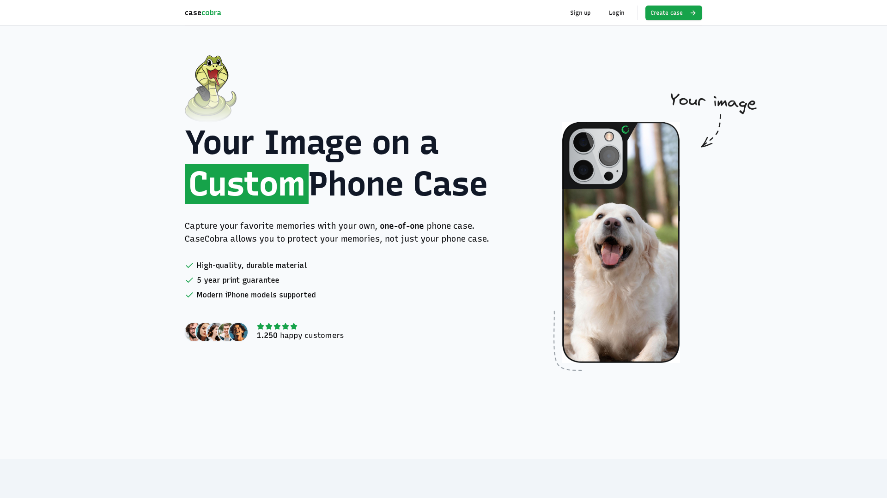

# 🐍 CaseCobra

CaseCobra is an online phone case store application built with Next.js, designed as a personal learning project. It features:

- 🎨 Phone case design customization
- 💳 Stripe payment integration
- 📦 Complete order management system

**Note:** _This website was built solely for learning purposes and is not intended for real-world use. Please do not enter any personal or sensitive information._



---

## 🛠️ Setup Steps

1. Clone the repository:

```
git clone https://github.com/mhergharibyan550/casecobra.git
```

2. Navigate to the root folder and install dependencies:

```
npm install
```

3.Review `.env.example` and create a `.env` file with the required values.

---

## 🚀 Usage

1. Navigate to the root directory and build the project:

```
npm run build
```

2. Start the application:

```
npm run start
```

3. Open your browser and visit:
   http://localhost:3000

---
